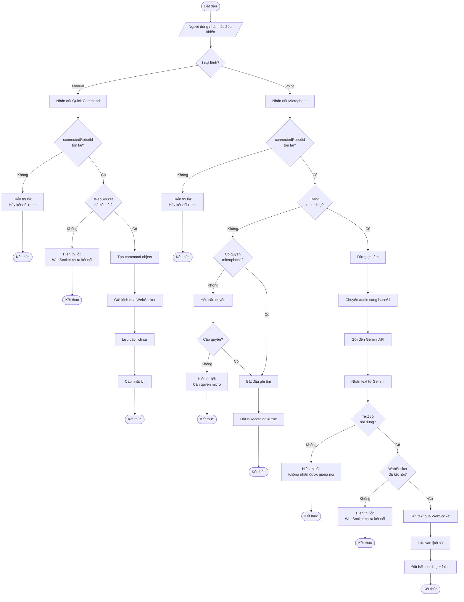

# Robot App Control

Ứng dụng di động điều khiển robot từ xa qua WebSocket với tích hợp điều khiển bằng giọng nói.

## Công Nghệ

- **React Native** 0.81.5 + **Expo** SDK 54
- **TypeScript** 5.9.2
- **Firebase Authentication**
- **WebSocket** (Real-time communication)
- **Gemini AI** (Voice-to-text)
- **Expo Router** (File-based routing)

## Cài Đặt

```bash
# Clone project
git clone <repository-url>

# Install dependencies
npm install

# Start development server
npm start
```

## Cấu Hình

Tạo file `app.config.js` hoặc cấu hình trong `app.json`:

```javascript
extra: {
  geminiApiKey: "YOUR_GEMINI_API_KEY"
}
```

## Cấu Trúc Dự Án

```
app/
├── (auth)/          # Màn hình đăng nhập/đăng ký
├── (tabs)/          # Màn hình chính
│   ├── index.tsx    # Danh sách robots
│   └── control.tsx  # Điều khiển robot
context/             # State management
├── AuthContext.tsx
├── RobotContext.tsx
└── CommandHistoryContext.tsx
library/
├── services/        # Business logic
│   ├── firebase.ts
│   ├── websocket-service.ts
│   ├── voice-service.ts
│   ├── robot-service.ts
│   └── token-refresh-service.ts
└── models/          # TypeScript interfaces
```

## Chức Năng

### Authentication
- Đăng ký/Đăng nhập với Firebase
- Auto refresh token (check mỗi phút)
- Auto logout khi token hết hạn

### Quản Lý Robot
- Xem danh sách robots có sẵn
- Kết nối/ngắt kết nối robot qua WebSocket
- Pull-to-refresh danh sách

### Điều Khiển
- **Điều khiển bằng giọng nói**: Ghi âm → Gemini AI chuyển thành text → Gửi lệnh
- **Nút điều khiển nhanh**:
  - Tiến/Lùi
  - Rẽ trái/Rẽ phải
  - Nâng/Hạ
  - Dừng lại
- Lịch sử 10 lệnh gần nhất

## Command Format

```json
{
  "intent": "tien|lui|re_phai|re_trai|nang|ha|dung_lai",
  "params": {
    "distance": 1,
    "unit": "m",
    "angle": 90
  }
}
```

## API Endpoints

- **Base URL**: `https://robot.skteam.studio/api`
- **WebSocket**: `wss://robot.skteam.studio/api/ws/client/{robotId}?token={idToken}`
- **GET** `/robots?token={token}` - Lấy danh sách robots

## Scripts

```bash
npm start          # Start Expo dev server
npm run android    # Run on Android
npm run ios        # Run on iOS
npm run web        # Run on web
npm run lint       # Run ESLint
```

## Build

```bash
# Build for production
eas build --platform android
eas build --platform ios
```

## Lưu Đồ Thuật Toán

### Luồng Điều Khiển Robot (Voice + Manual Command)



### Chú Thích Ký Hiệu:

- **Hình Oval** `([])`: Bắt đầu / Kết thúc
- **Hình Bình Hành** `[/\]`: Input / Output
- **Hình Chữ Nhật** `[]`: Process (Xử lý)
- **Hình Thoi** `{}`: Decision (Điều kiện if-else)

### Giải Thích Luồng:

**Manual Command Flow:**
```
if (loại lệnh == Manual) {
    if (connectedRobotId không tồn tại) {
        hiển thị lỗi;
    } else if (WebSocket chưa kết nối) {
        hiển thị lỗi;
    } else {
        tạo command → gửi qua WebSocket → lưu lịch sử → cập nhật UI;
    }
}
```

**Voice Command Flow:**
```
if (loại lệnh == Voice) {
    if (connectedRobotId không tồn tại) {
        hiển thị lỗi;
    } else if (đang recording) {
        dừng ghi âm;
        if (text rỗng) {
            hiển thị lỗi;
        } else if (WebSocket chưa kết nối) {
            hiển thị lỗi;
        } else {
            gửi text qua WebSocket → lưu lịch sử;
        }
    } else {
        if (không có quyền micro) {
            yêu cầu quyền;
            if (không cấp quyền) {
                hiển thị lỗi;
            } else {
                bắt đầu ghi âm;
            }
        } else {
            bắt đầu ghi âm;
        }
    }
}
```

## License

Private
